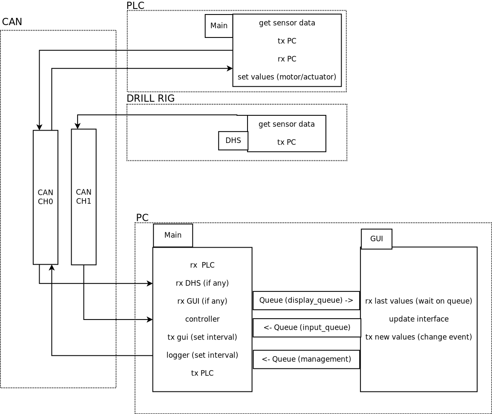

# Drillbotics 2022

## PLC
The PLC used is a Beckhoff 9020, and is programmed in structured text.

## PC
The PC side (the controller) is written in python with a Qt GUI

### Run Control System
From controller folder:

- Create a venv if needed.

- ```pip install -r requirements.txt```

- ```python main.py```


### Run unittests
From controller folder:

- ```python -m unittest discover test_pkg```

### Build GUI
(Only needed if changed)

From controller folder:

- ```pyuic5 qt_gui\interface.ui -o qt_gui\interface.py```

## General overview of the system



